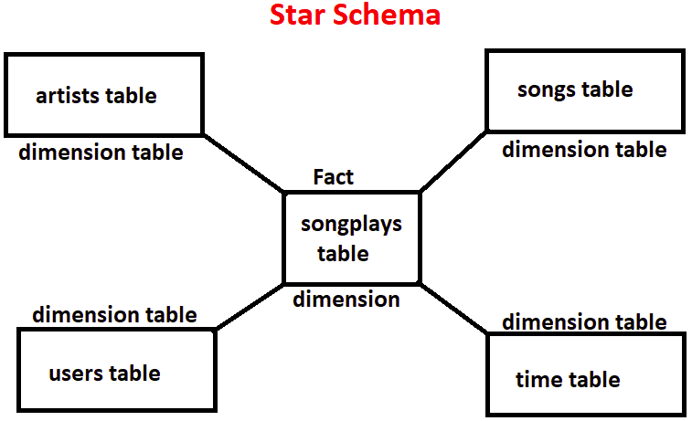
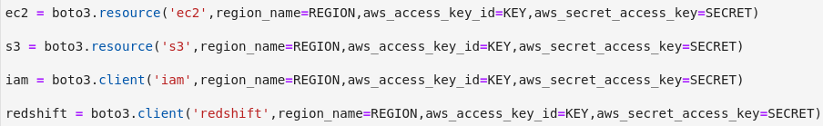
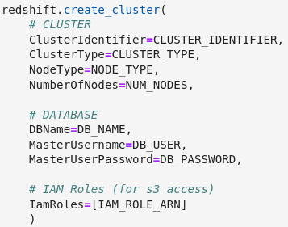
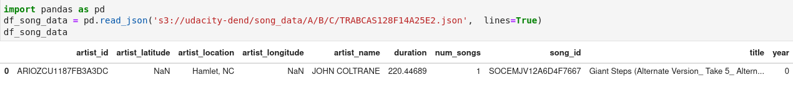
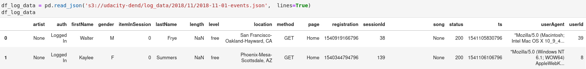
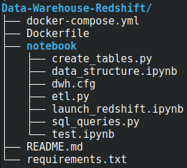
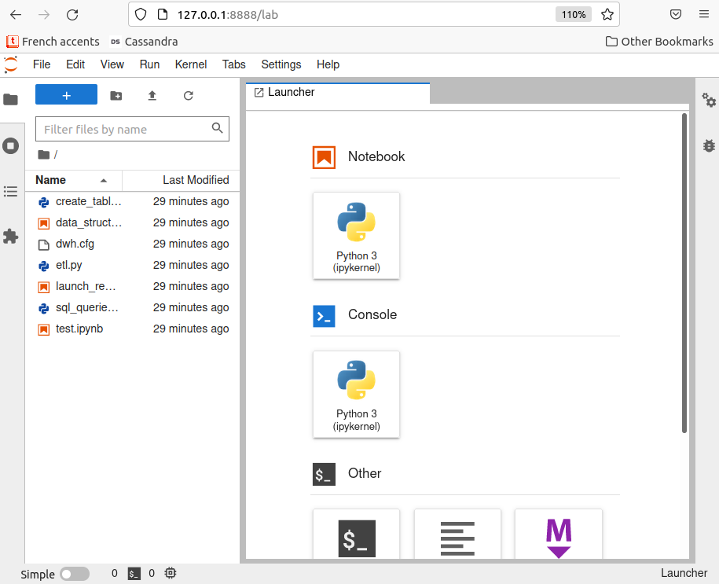
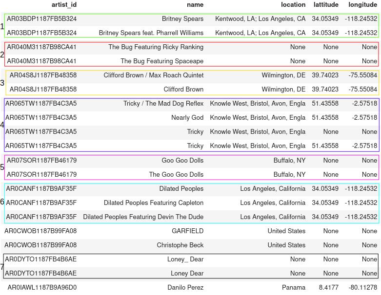

# Data Warehouse with AWS redshift

## Introduction

A music streaming startup, Sparkify, has grown their user base and song database
and want to move their processes and data onto the cloud. Their data resides in
S3, in a directory of JSON logs on user activity on the app, as well as a
directory with JSON metadata on the songs in their app.

My task as data engineer is to build an ETL pipeline that extracts their data
from S3, stages them in Redshift, and transforms data into a set of dimensional
and fact tables for their analytics team to continue finding insights into what
songs their users are listening to. Then I'll test the database and ETL pipeline
by running some queries.

## Data Model

### Why star schema ?



The star schema is the best choice in this case because:

- **songplays table**: is the only central table to which all dimension tables
  are linked.
- **Speed and performance**: Simple and fast queries with less `JOINs`.
- **Normalization**: dimension tables don't have to be normalized.

The dataset has been modeled into 4 dimension tables and 1 fact table.

### Dimension tables

- **artists table**: gives some info about the owner of the song
- **songs table**: gives some info about the song (title, duration, year, ...)
- **users table**: gives some info about who is listening to the song
- **time table**: gives some info about when the song was listened

### Fact table

- **songplays**: is connected to the 4 dimension tables and gives some info
  about what song was listened, the location of the user and the session ID.

# Configuring Redshift

To be able to use Amazon redshift, I need to create a cluster. Then I'll create
a database, which will contains all tables mentionned above. There are 2 ways to
create an AWS resource:

- [Using AWS website](https://docs.aws.amazon.com/redshift/latest/dg/tutorial-loading-data-launch-cluster.html)
  (Graphical user interface)
- Using Infrastructure as Code (IaC)

I'll be using IaC in this project. So I can easily automate, maintain and deploy
from python script by using [boto3](https://boto3.amazonaws.com/v1/documentation/api/latest/index.html)
package. Be aware that redshift needs an `IAM role` that has access to Amazon S3
, to be able to copy data from S3.

## Infrastructure as Code

- To access your AWS account on local computer you need an IAM user with
  `access_key` and `secret_access_key`.
- Then you can use those credentials to create a connection for a specific
  resource (ec2, s3, iam or redshift, ...).

  

- Finally, use that connection to create a new instance or interact with an
  instance that already exists.

  

# ETL pipeline

Recall that, according to business needs, cloud (AWS) has been chosen for data
storage. So data collected from the music app is stored into S3 bucket. Then
redshift has been chosen to build a data warehouse for analytics purposes.

## Copying data from S3 to Redshift

Before inserting data into dimensional and fact tables shown above. I need first
of all to copy data from S3 to temporary tables. The purpose here is to have all
data inside redshift. Then transform and load it into final tables that will be
used for analytic queries. For that reason I'll use the `COPY` command with the
following parameters:

```sql
-- required paramater
COPY staging_songs
FROM 's3://udacity-dend/song_data'
CREDENTIALS 'iam_role=arn:aws:iam::<aws-account-id>:role/<role-name>'
REGION 'us-west-2'

-- optional parameter
TIMEFORMAT AS 'epochmillisecs'
TRUNCATECOLUMNS BLANKSASNULL EMPTYASNULL
COMPUPDATE OFF
FORMAT AS JSON 'auto|s3://jsonpaths_file';
```

`staging_songs` is the name of the target table inside redshift.  
`s3://udacity-dend/song_data` is the location of the data to be loaded into the
target table.  
`CREDENTIALS` is a clause that indicates the method that redshift cluster will
use for authentication and authorization to access other AWS resources
(e.g iam_role).  
`FORMAT:` by default `COPY` command expects text files otherwise you can specify
the files format. `auto` option attempts to match all columns in the target
table to JSON field name keys. `JSONPaths file` explicitly maps column names to
JSON field name keys, especially for nested json files.  
`COMPUPDATE OFF`: automatic compression is disabled during a COPY.  
`BLANKSASNULL`: Loads blank fields, which consist of only white space characters
, as NULL.  
`EMPTYASNULL`: Indicates that Amazon Redshift should load empty CHAR and VARCHAR
fields as NULL.  
`TRUNCATECOLUMNS`: Truncates data in columns to the appropriate number of
characters so that it fits the column specification.  
`TIMEFORMAT`: Specifies the time format in the source file. `epochmillisecs` is
the number of milliseconds since January 1, 1970, 00:00:00 UTC. So the format in
the target table will be `YYYY-MM-DD HH:MI:SS` (by default) for TIMESTAMP columns.

Data will be copied from S3 to staging tables: `staging_songs` and `staging-events`
which have the same column names like below:




## Inserting data into final tables

For `artists`, `songs` and `users` tables the following syntax will be used.
Uniqueness, primary key, and foreign key constraints are informational only;
they are not enforced by Amazon Redshift. That why `DISTINCT` clause is used to
make sure there are no duplicated rows. I also make sure that the primary key is
not null.

```sql
INSERT INTO final_table (column1, column2, column3)
SELECT DISTINCT column1, column2, column3
FROM staging_table
WHERE primary_key IS NOT NULL;
```

For `time` table, the function `EXTRACT` is used to extract hour, day, week,
month, year and weekday from timestamp.  
For `songplays` table, both `staging_tables` are joined on
`artist`=`artist_name` and `song`=`title`. See `sql_queries.py` for more details

# Project structure



|       File/Folder       |                  Description                   |
| :---------------------: | :--------------------------------------------: |
| Data-Warehouse-Redshift |               working directory                |
|       Dockerfile        |            Define jupyterlab image             |
|   docker-compose.yml    |       jupyterlab container configuration       |
|    requirements.txt     |               required packages                |
|         etl.py          |      ETL script to load data into tables       |
|    create_tables.py     | script to create tables into redshift database |
|     sql_queries.py      |   SQL queries to create tables and load data   |
|  data_structure.ipynb   |          Have a look into data files           |
|  launch_redshift.ipynb  |  script to create and delete redshift cluster  |
|       test.ipynb        |        SQL queries to redshift database        |
|         dwh.cfg         |               configuration file               |

## Terminology

|       Name        |                   Description                   |
| :---------------: | :---------------------------------------------: |
| jupyter_container |              jupyterlab container               |
|       jlab        | jupyterlab service running on jupyter_container |

#### Dependencies

| Packages/Libraries |                                     Usage                                     |
| :----------------: | :---------------------------------------------------------------------------: |
|     jupyterlab     |      To use notebooks to write python and SQL within the same framework       |
|  psycopg2-binary   |                     python wrapper to connect to postgres                     |
|    ipython-sql     |                  To write directly SQL statement on notebook                  |
|       pandas       | To read JSON files into dataframe and process data before load it into tables |
|       boto3        |                 To create, configure, and manage AWS services                 |

## Quickstart

**Requirement**: docker and docker-compose are already installed.

1. Clone this repository: `https://github.com/mdifils/Data-Warehouse-Redshift.git`
2. Change directory: cd `Data-Warehouse-Redshift`
3. Build image: `docker-compose build --no-cache`
4. Create and run containers: `docker-compose up -d`
5. Check containers are running: `docker-compose ps`
6. check jupyterlab link (last line): `docker-compose logs jlab`
7. Copy jupyterlab link and paste it in your browser. Then open terminal inside
   jupyterlab (there is a terminal icon in the launcher), open `test.ipynb` and
   `launch_redshift.ipynb` notebooks (double-click in left side).



8. Follow instructions in `launch_redshift.ipynb` notebook and run cells one by
   one. But make sure to clean up AWS resources only when you don't need redshift
   cluster anymore. Don't forget to provide your AWS credentials when prompted
   for.
9. Switch to the terminal and type `python create_tables.py` in order create all
   tables.
10. Load data into tables : `python etl.py`
11. Go to `test.ipynb` notebook and run all cells to test your database. Don't
    to restart the kernel after running all cels.

# Data Quality Check

Check `test.ipynb` notebook for more details about the SQL query whose result is
shown below:



The result above shows some inconsistencies in the data collected that lead to
`artist_id` not being unique. It is possible to choose two columns to define
the primary key in order to garantee the its uniqueness. But there are still
some issues:

- Number `7`: `Loney Dear` is definitly the same artist than `Loney_Dear`.
  So the row with `Loney_Dear` should be deleted.
- Number `5`: `The Goo Goo Dolls` is definitly the same artist than `Goo Goo Dolls`
  So the row with `Goo Goo Dolls` should be deleted.
- Number `1`: `Britney Spears feat Pharrell Williams` is definitly not a single
  artist but instead two artists who sang the same song. It doesn't make sense
  because the artists don't have the same address and should have two different
  `artist_id`.

**Conclusion**: It is not easy to make some transformation in order to have
consistent and accurate data that make sense. The best thing to do is to make
sure that data is collected accurately. For this reason, if two artists sang
the same song. The app should record two rows, one artist per row with the same
song.
